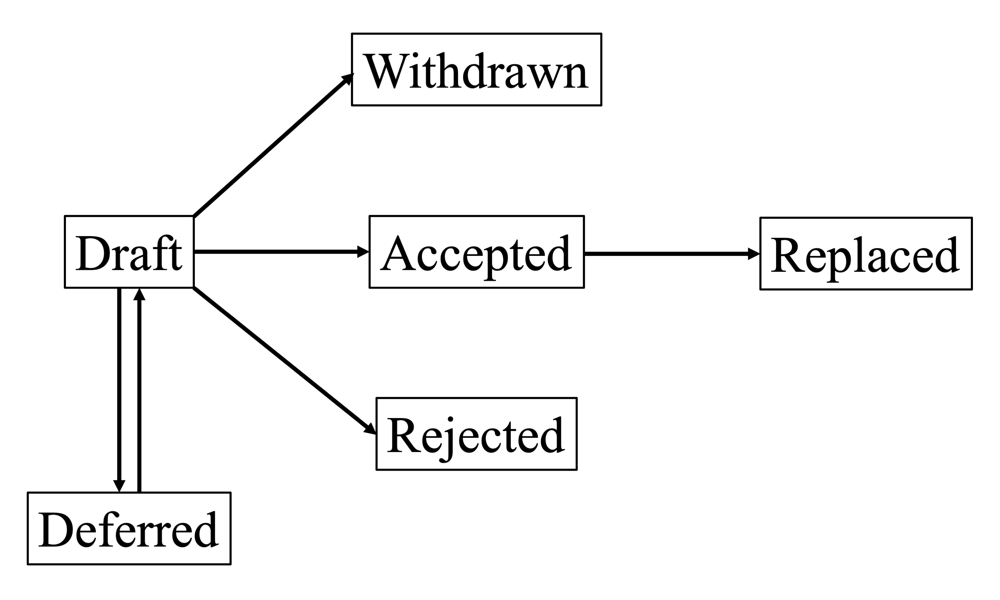

.. _fdp-0:

***************************
FDP 0 — How to write an FDP
***************************

=========== ======================================
=========== ======================================
**Author**  Andrey Rybakov (rybakov.ad@icloud.com)
**Created** 04.12.2025
**Status**  Draft
=========== ======================================

What is a FDP?
==============

FDP — "Format's Design Principle" — is a document that describes a design
principle of the spin Hamiltonian format. 

It is an UTF-8 coded text file written with the |reStructuredText|_ that follows
the :ref:`fdp-template`. A plain text file can be proposed as well, in that case
the Maintainer is responsible for converting it to the |reStructuredText|_.

Header
======

Each FDP should start with a preamble, that shall include the following
mandatory fields

* Author(s): <list of author's names and optionally e-mail addresses>
* Created: <date of creation in the format dd.mm.yyyy>
* Status: <Draft | Deferred | Accepted | Rejected | Withdrawn | Replaced>

And can include optional fields such as

* Manager: <name and e-mail address of the Manager>

Workflow
========

It is recommended to discuss the idea of FDP in the topical issue or issues
before proposing the formal FDP document.

Each FDP proposal should have a responsible person — *the Manager* — who will
submit a PR and will be responsible for shepherding the discussion, addressing
comments, and updating the document as needed.

If an FDP has a single author, then that author is considered to be the Manager.
If an FDP has multiple authors, then they should choose a single Manager amongst
themselves and list that person in the "Manager" field of the FDP header.

The possible evolution of the FDP status is described below

Proposal
--------

When the author(s) feel that the FDP is ready for review, a PR should be
submitted to the main brunch of the |spinham-format|_ via GitHub's pull request
to the "docs/source/fdp" directory with the name "fdp-<n>.rst". The PR should be
labeled with the "[FDP]" label. At the same time an issue named "FDP <n> - 
<short title> | proposal" should be created for the discussion of the FDP. 
All initial proposals should have the "Draft" status.

At the earliest convenience the PR should be merged by the Maintainer regardless
of the state of the discussion. New PRs can be created by the Manager to update
the FDP or by the Maintainer to set its status, update format, etc.

Discussion and review
---------------------

Any member of the organization can leave comments, raise issues or propose
changes within the topical issue. The Manager is responsible for addressing
comments, updating the document as needed. The discussion should continue until
a consensus is reached among the members.

Deferred
--------

FDP can be assign the ``Deferred`` status by the Manager or the Maintainer when
no progress is made made on the FDP.

Accepted
--------

When the consensus is reached, the Maintainer, at request of the Manager, should
notify all members stating that the FDP is ready and will be merged unless
objections are raised within 7 days. If no objections are raised within that
period, then the FDP becomes ``Accepted``. Period of 7 days can be extended by
the Manager, in that case the duration shall be communicated in the
notification.

Rejected
--------

If at any moment the consensus is that the idea of the FDP is not a good one or
the vote rejects the proposal if the discussion becomes stale, then FDP becomes
``Rejected``. In that case it is still recorded in the list of FDP's for future
reference.

Withdrawn
---------

The Manager can decide to withdraw the FDP at any moment before it becomes
``Accepted`` or ``Rejected``. Withdrawn FDP's are recorded in the list of FDP's
for future reference.

Stale discussion
----------------

If the consensus can not be reached and the discussion becomes stale,
then the decision about the FDP shall be made by the vote following the formula
1 tool = 1 vote. The vote is organized by the Maintainer and can be called by
the Manager or the Maintainer only if the discussion becomes stale.

Replaced
--------

The FDP becomes ``Replaced`` if a new FDP, that supersedes it, is ``Accepted``.
